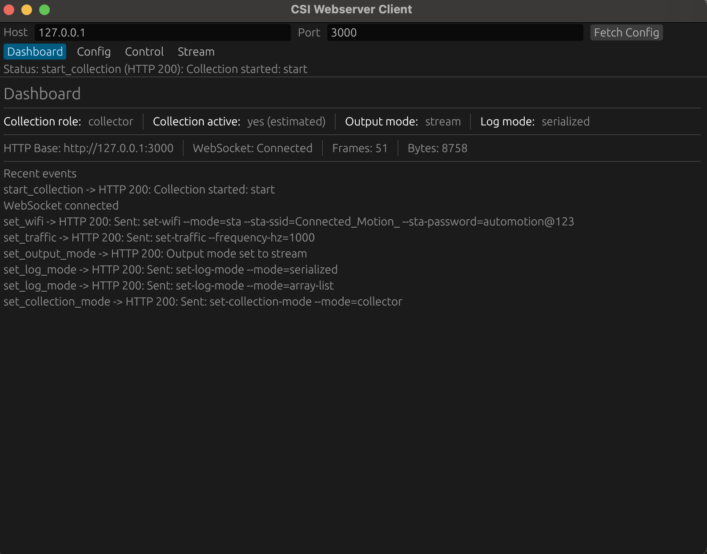

# csi-webclient



Desktop client for configuring and controlling `csi-webserver` remotely.

This project provides a native Rust GUI (egui/eframe) that talks to a running `csi-webserver` instance over HTTP and WebSocket. It is designed for responsive operation, strict architectural separation, and easy troubleshooting during CSI collection sessions.

## Features

- Configure all major webserver/device settings through REST endpoints.
- Control collection sessions (`start`, `reset`) without using raw serial tooling.
- Connect to `/api/ws` and view incoming CSI frame previews in real time.
- Switch runtime output behavior (`stream`, `dump`, `both`) from the UI.
- Works with modern log modes from the reworked webserver API:
  - `text`
  - `array-list`
  - `serialized`

## Architecture

The codebase intentionally separates responsibilities into three domains:

- `src/state`: source of truth for app data and UI-visible state.
- `src/ui`: rendering-only modules (dumb UI, no network/business orchestration).
- `src/core`: side effects (HTTP requests, WebSocket loop, async runtime, channels).

Top-level intent orchestration and event application happen in `src/app.rs`.

## Documentation

- Crate-level docs for docs.rs are maintained in `docs/CRATE_DOCS.md` (independent from this README).
- HTTP/WebSocket API reference is maintained in `docs/HTTP_API.md`.

## Webserver Compatibility

The client targets `csi-webserver` APIs described in the reworked README, including:

- `GET /api/config`
- `POST /api/config/reset`
- `POST /api/config/wifi`
- `POST /api/config/traffic`
- `POST /api/config/csi`
- `POST /api/config/collection-mode`
- `POST /api/config/log-mode`
- `POST /api/config/output-mode`
- `POST /api/control/start`
- `POST /api/control/reset`
- `GET /api/ws`

## Build

```bash
cargo build --release
```

## Run

```bash
cargo run --release
```

When the app starts, set host/port in the top bar to match your webserver (default `127.0.0.1:3000`), then use the tabs:

- `Config`: send configuration endpoints.
- `Control`: start/reset and connect/disconnect WebSocket.
- `Stream`: inspect frame counters and recent payload previews.
- `Dashboard`: view status and event history.

## Development

```bash
cargo check
cargo test
```

`cargo test` is optional in the current codebase (few/no tests yet), but should be preferred for core/state logic whenever new behavior is added.

## License

See `LICENSE`.
